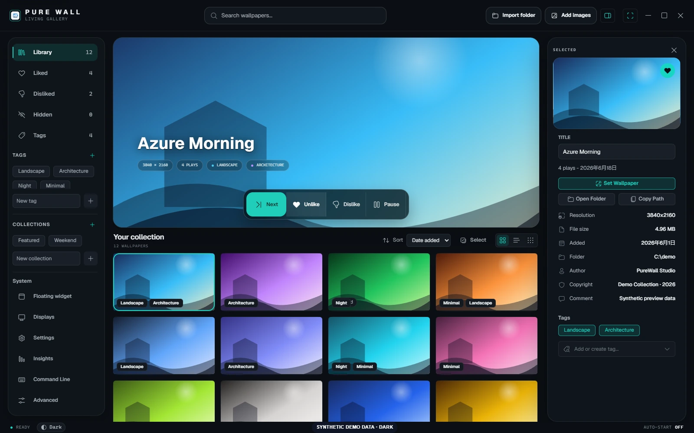
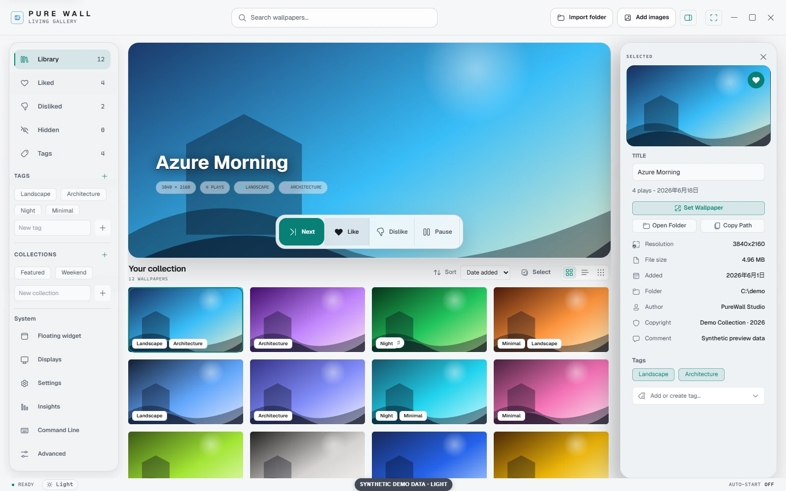
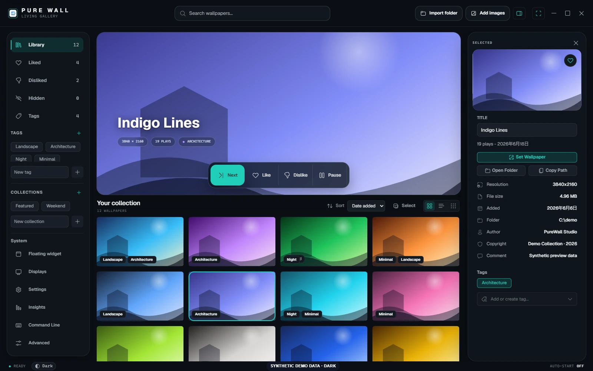
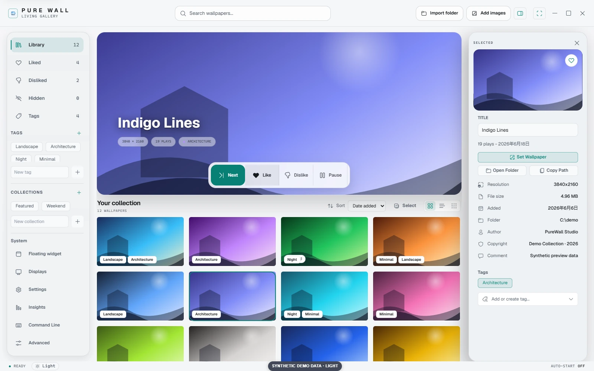
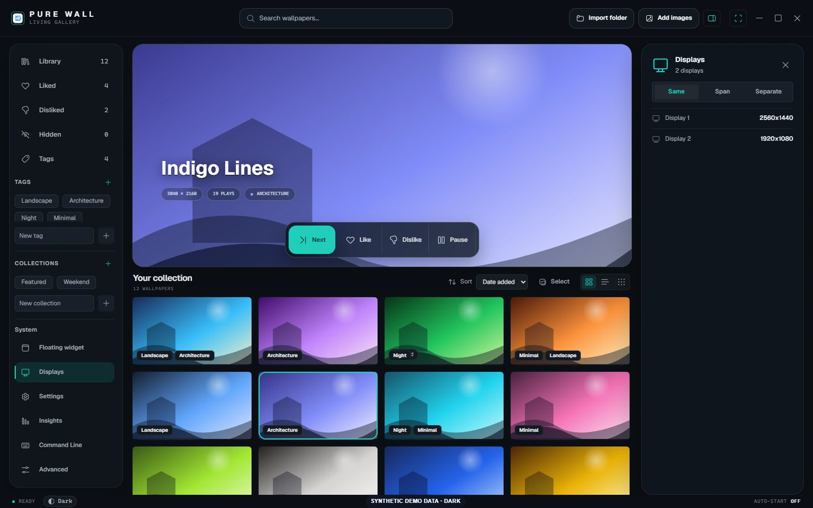
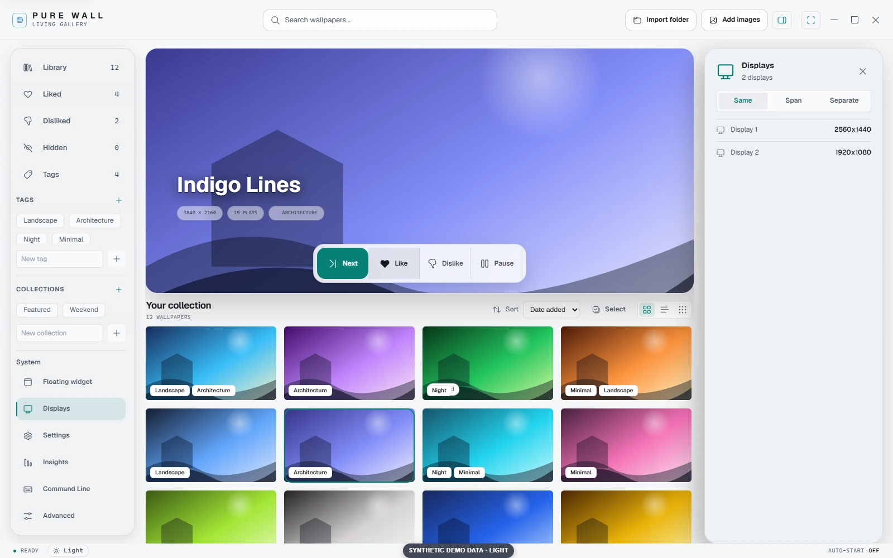

<p align="center">
  
</p>

<h1 align="center">PureWall</h1>

<p align="center">A local-first Windows wallpaper manager for the images you already own.</p>

<p align="center">
  <a href="LICENSE"></a>
  
  
  <a href="https://github.com/WiseZenn/PureWall/actions/workflows/ci.yml"></a>
  <br>
  <sub>Open source · first verified binary release pending</sub>
</p>

<p align="center">
  
  
</p>

<p align="center"><em>Real Vue renders with synthetic data. No personal wallpaper library is shown.</em></p>

## The simple loop

PureWall is built around one familiar interaction: move through your local wallpaper library, then react to what you see.

| 1. Add | 2. Next | 3. React |
| --- | --- | --- |
| Import a folder or selected images. Originals stay where they are. | Press **Next** for another random wallpaper. | Press **Like** to see it more often, or **Dislike** to keep it out of rotation. |

The wallpaper shown on the stage is the exact item rated. Pressing the active rating again clears it, and liked wallpapers receive extra weight in later random rotation.

## What PureWall includes

| | |
| --- | --- |
| **Local library**<br>Search, sort, paginate, hide, and inspect wallpaper files without copying them. | **Tags and collections**<br>Organize individual items or apply batch changes to larger libraries. |
| **Random rotation**<br>Use Next, timed playback, Pause, Like, and Dislike through one shared playback path. | **Multi-display modes**<br>Apply the same image, span one image, or rotate displays independently. |
| **Small controls**<br>Use the optional floating widget, tray actions, or PureWall-owned context-menu commands. | **Library care**<br>Track unavailable files, relocate sources, and back up or restore local metadata. |

Light and dark themes, focus auto-pause, yearly playback insights, and keyboard-accessible controls are also included.

## Scope by design

PureWall manages local images. It does not ship an online wallpaper feed, an account system, or a recommendation service, and it does not copy imported originals into an application library.

PureWall-X is a later product. Its online or experimental behavior is deliberately kept out of the ordinary PureWall workflow; see the [roadmap](ROADMAP.md).

## Install and start

No verified public binary is available yet. When a signed release exists, download it only from [PureWall Releases](https://github.com/WiseZenn/PureWall/releases) and verify its checksum, signer, and provenance.

The [Windows installation guide](docs/INSTALLATION.md) explains NSIS versus MSI, release verification, local data, uninstall behavior, and source builds. PureWall does not publish a portable executable.

To run the current source on Windows 10 or 11, install Node.js `20.19+` or `22.12+`, Rust stable with the MSVC toolchain, WebView2, and Git:

```powershell
git clone https://github.com/WiseZenn/PureWall.git
cd PureWall
npm ci
npm run test:release-contract
npm run verify:release
npm run build
cargo check --manifest-path src-tauri/Cargo.toml
npm run tauri dev
```

Once PureWall opens, choose **Import Folder** or **Add Images**. Supported formats are JPG/JPEG, PNG, BMP, and WebP on local fixed Windows drives.

## Screenshots

<p align="center">
  
  
</p>

<p align="center">
  
  
</p>

The screenshots are generated from the real Vue interface with mocked Tauri commands and synthetic images. They are not native WebView2, installer, or release evidence.

Regenerate and validate all six screenshots with `npm run qa:screenshots`. The capture harness waits for fonts, decoded images, stable geometry, and the absence of loading placeholders.

## Data, privacy, and Windows safety

PureWall keeps ratings, tags, collections, settings, caches, and playback history in a local SQLite-backed data directory under `%APPDATA%\com.purewall.app`. Ordinary library use requires no account or cloud library.

Optional autostart and context-menu integrations write only PureWall-owned entries under HKCU. PureWall does not write HKLM, modify Windows policy, or disable the Windows 11 context menu.

File deletion requires confirmation and is limited to explicitly selected, registered wallpaper files on safe local volumes. PureWall uses the Windows Recycle Bin and retains metadata when the outcome cannot be proven.

UNC, mapped network, removable or unknown volumes, and observed reparse/provider boundaries are rejected. See the [security policy](SECURITY.md) for the complete reporting and safety boundary.

## Architecture and development

| Layer | Technology | Responsibility |
| --- | --- | --- |
| Desktop shell | Tauri 2 + WebView2 | Windows lifecycle, tray, IPC, and packaging |
| Interface | Vue 3 + TypeScript | Library, playback, organization, settings, and accessibility |
| Native layer | Rust + Windows APIs | Scanning, wallpaper control, file and registry safety |
| Persistence | SQLite | Local metadata, history, sources, and settings |

Contributor-facing module maps, IPC boundaries, SQLite schema notes, playback ownership, watcher behavior, and update design live in [docs/ARCHITECTURE.md](docs/ARCHITECTURE.md).

Before opening a pull request, run the full gate in [CONTRIBUTING.md](CONTRIBUTING.md). Maintainers should use [docs/RELEASING.md](docs/RELEASING.md) for signing, draft review, checksums, attestation, and installer smoke.

## Project status

The local application and release automation are implemented. This does not prove that hosted CI, signing, updater delivery, provenance, installer lifecycle smoke, or publication has run.

The first public release still requires a reachable public repository, a green matching Windows CI run, signing configuration, an authorized tag, a reviewed draft release, and disposable-runner smoke evidence.

## Contributing and support

- [Contributing guide](CONTRIBUTING.md) — setup, verification, pull requests, and native safety rules.
- [Support guide](SUPPORT.md) — setup help, reproducible bugs, and the correct reporting channel.
- [Security policy](SECURITY.md) — private vulnerability reporting and destructive-behavior boundaries.
- [Roadmap](ROADMAP.md) — completed phases, external evidence still required, and deferred PureWall-X work.
- [Changelog](CHANGELOG.md) — notable user-facing and release-readiness changes.

Please use synthetic or fully redacted data in issues, pull requests, screenshots, logs, and test evidence.

## License

PureWall is open source under the [MIT License](LICENSE).
