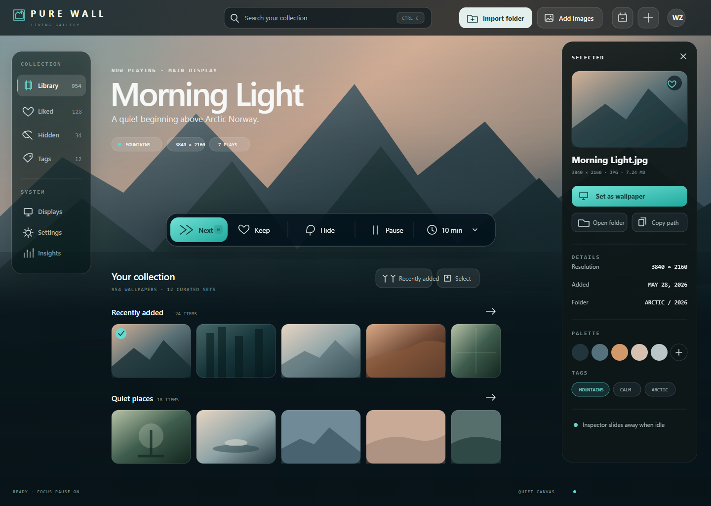

# PureWall

PureWall is an open-source Windows wallpaper manager built with Tauri 2, Vue 3, TypeScript, Rust, Tailwind CSS, and SQLite. It focuses on a straightforward local-library loop: play wallpapers, move to the next one, and teach the rotation through Like and Dislike.



_Product interface preview — a committed design reference for the local-library workbench, not installer or release-test evidence._


_Icon motion — the committed compatibility GIF for PureWall's brand motion._

## Project status

PureWall's local application foundation is implemented, and Phase 5 is building the public release loop. The repository currently provides local build and verification commands. It does **not** claim that signing, updater delivery, remote CI, or clean install/upgrade/uninstall smoke has run unless a specific published release records that evidence.

No tagged public release should be assumed from this README alone. Until a verified release is published, build from source and treat release automation, signing, updates, and installer lifecycle evidence as pending work tracked in [ROADMAP.md](ROADMAP.md).

## What PureWall does

- Imports local wallpaper folders or selected image files without copying the originals into app data.
- Browses large libraries with local metadata, search, tags, collections, hidden items, and batch actions.
- Rotates wallpapers with a liked-weighted random choice and explicit Next, Like, Dislike, and Pause controls.
- Sends user-confirmed file deletion to the Windows Recycle Bin.
- Supports same, span, and independent multi-display wallpaper placement.
- Offers optional PureWall-owned desktop context-menu and autostart integrations.
- Keeps SQLite metadata, settings, derivative caches, and play history under `%APPDATA%\com.purewall.app`.
- Provides a floating widget, light/dark themes, Quiet Canvas, metadata backup/restore, and compact yearly insights.

## Five-step local-library quick start

1. Install a verified published Windows build from [PureWall Releases](https://github.com/WiseZenn/PureWall/releases) when one is available, or complete the source build below and launch PureWall.
2. Choose **Import folder** or import selected files from a local drive. PureWall accepts JPG/JPEG, PNG, BMP, and WebP; UNC paths and mapped network drives are rejected.
3. Browse the library and use Like, Dislike, tags, collections, or Hidden to organize what you already own.
4. Use Next or choose a rotation interval. Liked wallpapers receive additional selection weight while the sequence remains random.
5. Enable the floating widget, autostart, focus pause, or desktop context menu only if you want those optional local integrations.

PureWall references original image paths. Moving or deleting an original outside PureWall can make the item unavailable, but its local rating, title, tag, and collection metadata is retained for recovery.

## Windows install and download verification

When a release is published, open [PureWall Releases](https://github.com/WiseZenn/PureWall/releases), select the exact version you intend to install, and obtain every file only from that matching release page. Expected Windows deliverables may include an NSIS `*-setup.exe`, an MSI `*.msi`, or an advanced/manual executable. The matching release notes must state which artifacts are supported and which signing, lifecycle, and provenance checks actually ran.

When a release provides `SHA256SUMS.txt`, download it from the same release and compare the artifact hash:

```powershell
Get-FileHash .\PureWall_<version>_x64-setup.exe -Algorithm SHA256
Get-Content .\SHA256SUMS.txt
```

The hexadecimal value must exactly match the corresponding line. A filename is not proof of origin.

If release notes designate an artifact as Authenticode-signed, verify it before running:

```powershell
Get-AuthenticodeSignature .\PureWall_<version>_x64-setup.exe | Format-List Status,StatusMessage,SignerCertificate
```

The expected status is `Valid`, with the signer described by that release. Do not bypass an unexpected SmartScreen or signature warning merely because the file is named PureWall.

When release notes state that GitHub artifact provenance is available, verify it with GitHub CLI:

```powershell
gh attestation verify .\PureWall_<version>_x64-setup.exe --repo WiseZenn/PureWall
```

Checksums, Authenticode, updater signatures, and GitHub provenance are separate controls. Their future design is documented, but only evidence attached to an actually run release counts as verification.

## Maintainer release automation

Releases are driven by pushing a `v<SemVer>` tag that matches all three application version declarations (`package.json`, `src-tauri/Cargo.toml`, and `src-tauri/tauri.conf.json`). The tag push runs `.github/workflows/release.yml`, which builds, signs, checksums, and attests the Windows artifacts, then creates **only a draft** GitHub Release. Publishing the draft is a deliberate maintainer action after review. Manual `workflow_dispatch` dry-runs build and attest artifacts without creating a release unless `publishDraft` is explicitly enabled.

Provision these GitHub Actions **secrets** (names only; values are never committed or documented here):

```text
WINDOWS_CERTIFICATE                 base64-encoded PFX containing the Authenticode code-signing certificate
WINDOWS_CERTIFICATE_PASSWORD        password for that PFX
WINDOWS_CERTIFICATE_TIMESTAMP_URL   HTTPS RFC 3161 timestamp server URL
TAURI_SIGNING_PRIVATE_KEY           Tauri updater signing private key (base64)
TAURI_SIGNING_PRIVATE_KEY_PASSWORD  optional password for the updater private key
```

And this repository **variable**:

```text
TAURI_SIGNING_PUBLIC_KEY   Tauri updater signing public key
```

Rotate `TAURI_SIGNING_PRIVATE_KEY` together with the code-signing certificate and a published release: every released updater artifact must be verifiable with the key shipped in the next release. Keep the public key and certificate recoverable in a protected store — losing the updater private key or letting the code-signing certificate expire blocks future signed releases. Timestamped Authenticode signatures remain valid after certificate expiry, so the HTTPS timestamp URL is required at build time.

Draft review checklist before publishing a release:

1. Confirm every artifact on the draft is Authenticode `Valid` (`Get-AuthenticodeSignature`).
2. Confirm `SHA256SUMS.txt` matches every downloaded artifact (`Get-FileHash -Algorithm SHA256`).
3. Confirm the updater `latest.json` and `.sig` signatures match the artifacts.
4. Confirm provenance with `gh attestation verify <artifact> --repo WiseZenn/PureWall`.
5. Only then publish the draft and record the release evidence.

Checksums, Authenticode, updater signatures, and GitHub provenance are separate controls; see the install verification section above for consumer-side commands.

## Contributor first-build quick start

Requirements:

- Windows 10 or 11.
- Node.js `20.19+` or `22.12+`.
- Rust stable with the MSVC toolchain.
- Microsoft Edge WebView2 Runtime.
- Git.

From a clean clone:

```powershell
git clone https://github.com/WiseZenn/PureWall.git
cd PureWall
npm ci
npm run test:release-contract
npm run verify:release
npx vue-tsc --noEmit
npm run test:unit
npm run build
cargo fmt --manifest-path src-tauri/Cargo.toml -- --check
cargo check --manifest-path src-tauri/Cargo.toml
cargo test --manifest-path src-tauri/Cargo.toml
cargo clippy --manifest-path src-tauri/Cargo.toml --all-targets -- -D warnings
npm run tauri build
```

`npm run tauri build` is the first complete local packaging command. A successful local package is not proof of remote CI, signing, provenance, updater delivery, or installer lifecycle testing.

For interactive development:

```powershell
npm run tauri dev
```

Native development uses PureWall's normal Windows app-data boundary. Use a disposable Windows account and a synthetic wallpaper library for destructive or integration testing; never treat a browser mock as native Windows evidence.

## FAQ

### Does PureWall upload my library or metadata?

No online wallpaper service or feed is part of current PureWall. Original images remain at their local paths, and application metadata is stored in the local SQLite database under `%APPDATA%\com.purewall.app`. Ordinary use does not require a cloud account.

### Which files and paths are supported?

PureWall imports JPG/JPEG, PNG, BMP, and WebP from local Windows paths. UNC paths, extended UNC paths, and mapped network drives are rejected. Symbolic-link entries are skipped during recursive folder scans.

### What happens when I delete a wallpaper in PureWall?

After the UI's pending-delete/Undo window completes, PureWall sends only the selected, registered wallpaper file to the Windows Recycle Bin and then removes its library row. It does not recursively delete a source folder. Test delete behavior only with disposable files.

### What happens if a source file disappears outside PureWall?

PureWall marks the source unavailable in normal library views while retaining recoverable metadata such as rating, title, tags, and collections. Restore the file, rescan/retry the source, or use source relocation when the folder moved.

### Why does Windows SmartScreen warn about a build?

Local source builds and unsigned artifacts can trigger Windows reputation warnings. A future releasable artifact must have explicit Authenticode and release evidence, but this repository does not claim that every available binary is signed. Verify the release checksum, signer, and provenance when provided; do not bypass an unexpected warning.

### Does PureWall update itself?

PureWall ships a signature-verified update path (Tauri updater): the Settings panel can check for updates, review release notes, and explicitly download/install an update. Update artifacts are fetched only over HTTPS and verified with Tauri's mandatory signature checks. That path is implemented and unit-tested, but it has not yet been exercised against a real signed release: until a published release documents its updater endpoint, treat updates as unverified and prefer downloading the newer release, verifying it independently, and following its release notes. See [ROADMAP.md](ROADMAP.md).

### Where do generated screenshots and design candidates belong?

Curated public images live under `design/` or `docs/images/`. Raw generated candidates and QA captures stay in ignored `output/`. See [docs/REPOSITORY_POLICY.md](docs/REPOSITORY_POLICY.md).

## Troubleshooting

### The window is blank or WebView2 is unavailable

Install or repair the Microsoft Edge WebView2 Runtime, apply supported Windows updates, then retry. For a source build, confirm the frontend gate (`npm run build`) passes before diagnosing native rendering.

### A folder or file is rejected

Confirm the path is on a local Windows drive and the file extension is JPG/JPEG, PNG, BMP, or WebP. Network shares, UNC paths, mapped network drives, and unsupported image types are intentionally rejected. Copy the files to a local folder if you want PureWall to manage them.

### Previously imported wallpapers are missing

Check whether the original file or source folder was moved, renamed, disconnected, or deleted. Open the library-source settings to rescan, retry, or relocate the source. PureWall preserves metadata for unavailable files rather than silently deleting it.

### Autostart or desktop context-menu actions do not appear

Disable and re-enable the integration from PureWall, then capture a redacted bug report if it still fails. These controls are limited to PureWall-owned HKCU entries. Do not enable legacy Windows menus, edit HKLM, or change Windows shell policy as a workaround.

### Cargo, Vite, or npm reports build-cache access denied

Close only development/build processes you started, ensure the clone and its `node_modules`, `dist`, and `src-tauri/target` paths are writable, then rerun the same command from a normal developer PowerShell. Do not delete `%APPDATA%\com.purewall.app` or change system policy to solve a compiler-cache permission error. When reporting the problem, include the command and redacted cache path.

## Optional integration cleanup

Before uninstalling, disable Autostart and unregister the desktop context menu inside PureWall. Those actions target only PureWall-owned HKCU entries:

```text
HKCU\Software\Classes\Directory\Background\shell\PureWall
HKCU\Software\Classes\Directory\Background\shell\PWNext
HKCU\Software\Classes\Directory\Background\shell\PWLike
HKCU\Software\Classes\Directory\Background\shell\PWDislike
HKCU\Software\Classes\Directory\Background\shell\PWPause
HKCU\Software\Classes\PureWall_Commands
HKCU\Software\Microsoft\Windows\CurrentVersion\Run\PureWall
```

PureWall does not need HKLM cleanup and must not alter Windows shell policy keys.

## Contributing and support

- Read [CONTRIBUTING.md](CONTRIBUTING.md) before changing code or public artifacts.
- Use [SUPPORT.md](SUPPORT.md) to choose Discussions, a reproducible bug report, or a private security advisory.
- Read [SECURITY.md](SECURITY.md) before testing file, registry, installer, traversal, IPC, or updater/signature boundaries.
- Engineering architecture and accepted decisions live under `docs/project-docs/`.

## License

PureWall is released under the MIT License. See [LICENSE](LICENSE).
